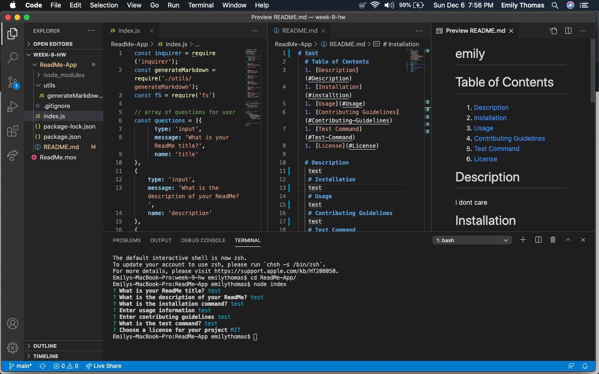

# Welcome to my ReadMe App!
  ## Description
   In this project I have created an app that will allow users to create thier files using Node.js. The application I have created will go through questions about your project, and once the questions are completed a ReadMe markdown file will be created. Below you will see a video demonstration!
   
   
   
   ## My GitHub and LinkdIn

   
   
   
  
